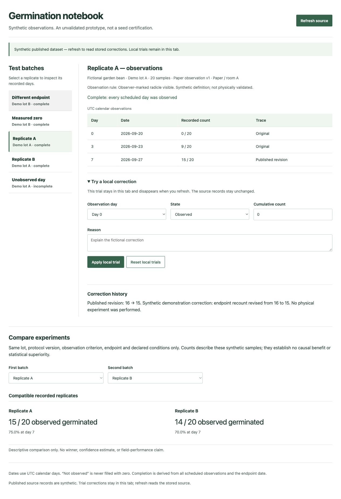

# Public deployment status

Observed October 3, 2026 (KST). This updates the initial source-export preparation described in README and RELEASE_VALIDATION. It is a deployed synthetic demonstration; final DEV contest entry is still pending.

- Live app: https://estona815.github.io/germination-observation-notebook-2026/
- Source: https://github.com/estona815/germination-observation-notebook-2026
- Initial reviewed source commit: 78b2f99f4332c6d36d42de3855415f0c03aa1043
- Sanity public project: pa0x69l2; dataset: production.

GitHub Pages published main /docs over HTTPS. All 18 served HTML, JavaScript and notice files matched the reviewed compiled release exactly (282,551 response bytes); .nojekyll is deployment configuration, not a served asset. A separate Codex reviewer read all 54 initial public source files and independently verified exact original bytes (773,902 bytes). No new original-code license is granted.

The public browser fetched the actual published synthetic source, without a token or fixture fallback. The configured public CORS origin is https://estona815.github.io, with credentials disabled. A token-free Origin query returned HTTP 200, the matching allow-origin header, and 26 documents.

Actual public-browser checks displayed the saved 16-to-15 revision and compatible A/B counts of 15/20 (75%) and 14/20 (70%). Measured zero remained complete. Day 3 missing stayed incomplete and comparison was withheld. A trial 21/20 was rejected; Reset left the published source unchanged. These are bounded prototype checks, not biological evidence, server-enforced immutability, or human technical QA.

The accompanying image is an unedited capture of the actual public app, with invented data and the published correction. It contains no account settings, private contact details or authentication material.

Codex generated and checked this implementation and publication documentation under the participant's instructions. No paid AI/API calls or additional credits were used for this publication. No award, organizer acceptance or final DEV submission is claimed.
